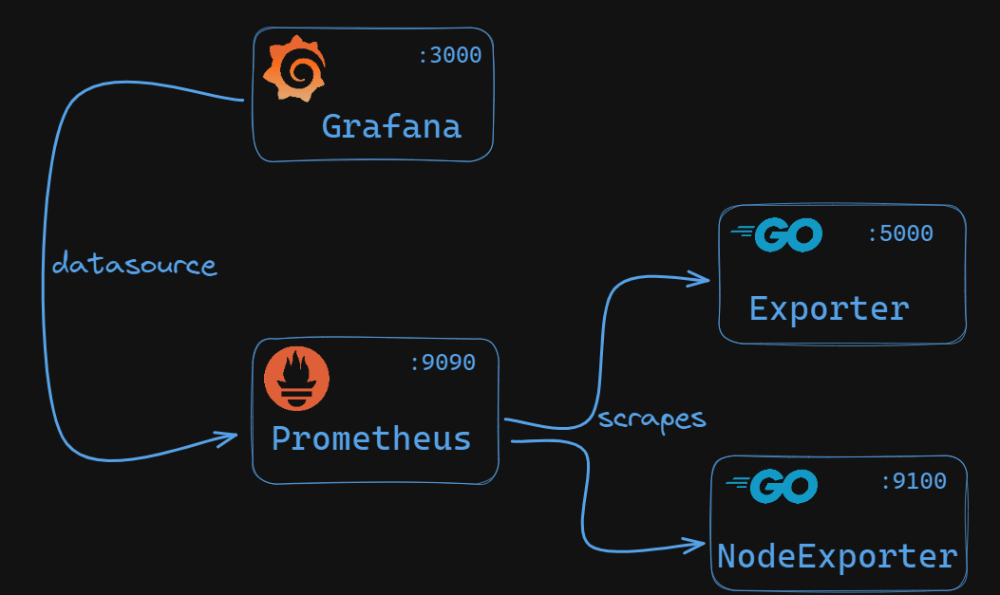
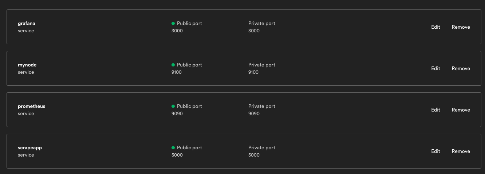

# monitoringStack
Monitoring stack comprised of Grafana/Prometheus/Golang



## Local setup

* Spin up standalone [Go web-app/exporter](https://hub.docker.com/repository/docker/dejanualex/go_promexporter/general):
```
docker run -p 5000:5000 dejanualex/go_promexporter:1.1
```
* Spin up the stack
```bash
# check config
docker-compose -f docker-compose.yml config
# start in foreground
docker-compose -f docker-compose.yml up --remove-orphans
# stop services
docker-compose -f docker-compose.yml down
```
* Prometheus should be available : http://127.0.0.1:9090/
* Grafana should be available: http://127.0.0.1:3000/login
* Blackbox Go exporter should be available: http://127.0.0.1:5000/ and http://127.0.0.1:5000/metrics

## Bunnyshell setup

